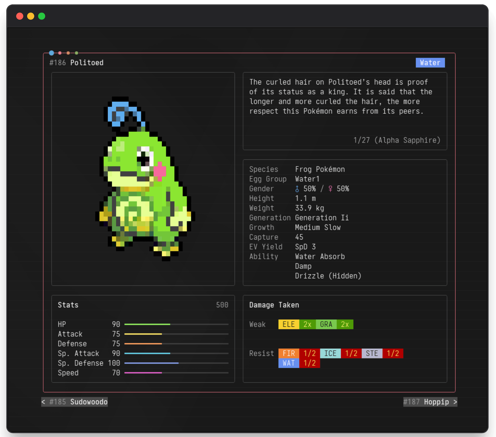

<div align="center">
  
  <h1>pkdx</h1>
  <p>
    <a href="https://www.npmjs.com/package/@fbb.sh/pkdx"></a>
    <a href="LICENSE"></a>
    <a href="docs/coverage.svg"></a>
  </p>
</div>

A terminal Pokédex with fuzzy search, form selection, sprites, stats, abilities, evolutions, flavor text, and damage matchups.

## Requirements

- macOS, Linux, WSL, Git Bash, or Windows PowerShell/CMD
- A Unicode terminal with 24-bit color support
- Kitty graphics support for best sprite rendering, such as Kitty or WezTerm; other terminals fall back to block-rendered sprites
- Internet access

## Install

```bash
npm install -g @fbb.sh/pkdx
```

## Run

Start the app:

```bash
pkdx
```

or start with an initial query:

```bash
pkdx pikachu
```

## Screenshot

<p align="center">
  
</p>

## Credits

- [PokeAPI](https://pokeapi.co/) for Pokémon data.
- [PokéSprite](https://github.com/msikma/pokesprite) and [PokeAPI Sprites](https://github.com/PokeAPI/sprites) for sprite artwork and upstream sprite credits.
- [OpenTUI](https://github.com/anomalyco/opentui) for the terminal UI runtime.
- [Pokémon Database](https://pokemondb.net/) for external Pokédex links.

## License

MIT. See [`LICENSE`](LICENSE).
